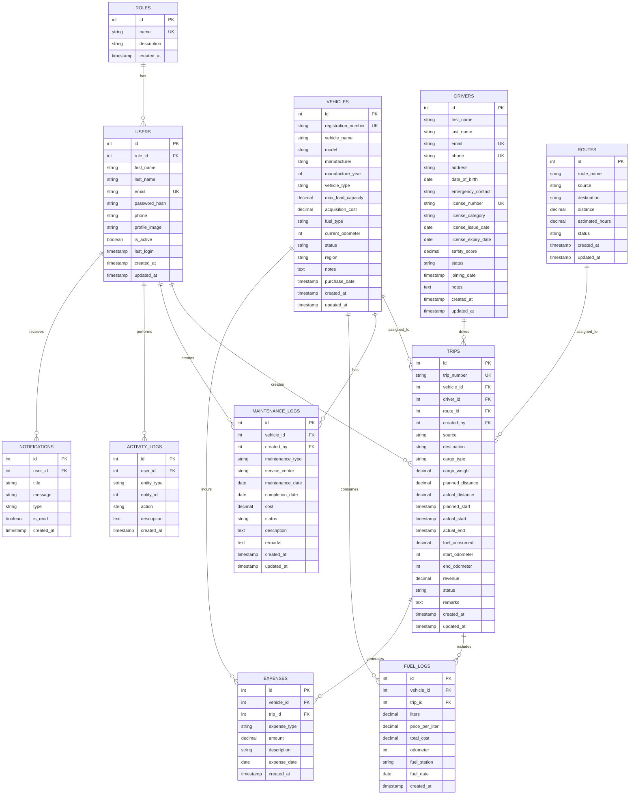

# 🗄️ Database Architecture

TransitOps is powered by a relational schema implemented in **PostgreSQL** and modeled with **Prisma ORM**. 

Below is the Entity-Relationship (ER) diagram followed by a detailed overview of each table and its role in the system.

---

## 📊 Entity-Relationship Diagram

---

## 🗄️ Table Details

### 1. `roles`
Stores authorization groups that govern role-based access control.
*   `id`: Primary key (autoincrement).
*   `name`: Unique role label (e.g. `Admin`, `Fleet Manager`, `Driver`, `Financial Analyst`).
*   `description`: Description of permissions.

### 2. `users`
System operators who log into the application.
*   `role_id`: Links to user's primary authorization role.
*   `email`: Unique username for authentication.
*   `password_hash`: Securely hashed password.
*   `is_active`: Controls whether the user is authorized or redirected to the `/pending` registration queue.

### 3. `vehicles`
Fleet vehicle assets.
*   `registration_number`: Unique license plate identifier.
*   `status`: Operational status indicator (`Available`, `On Trip`, `In Shop`, `Retired`).
*   `max_load_capacity`: Cargo capacity in kilograms.
*   `current_odometer`: Running total odometer for trip validation.

### 4. `drivers`
On-duty dispatch drivers.
*   `license_number`: Driver's legal operating license.
*   `license_expiry_date`: Tracked to prevent assigning expired drivers to active trips.
*   `safety_score`: Out of 100, updated based on driving history and performance.
*   `status`: Work status (`Available`, `On Trip`, `On Leave`).

### 5. `routes`
Geographic pathways mapped for transport planning.
*   `source` & `destination`: Named locations.
*   `distance` & `estimated_hours`: Planned metrics to validate fuel costs and schedules.

### 6. `trips`
Core transactional table detailing dispatched freight shipments.
*   Links `vehicles`, `drivers`, `routes`, and the dispatching `users`.
*   Records planned vs. actual distances, odometer values, fuel used, cargo payload details, revenue, and statuses (`Draft`, `Dispatched`, `In Progress`, `Completed`, `Cancelled`).

### 7. `maintenance_logs`
Historical records of vehicle servicing.
*   `maintenance_type`: Categorizes work (e.g., Oil Change, Engine Tuning, Tire Rotation).
*   `cost`: Monetary cost of repair.
*   `status`: Status of repairs (`Scheduled`, `In Progress`, `Completed`, `Cancelled`).

### 8. `fuel_logs` & `expenses`
Financial logging tables.
*   `fuel_logs`: Liters, price, total cost, and mileage metrics to evaluate fuel efficiency.
*   `expenses`: Non-fuel trip costs (e.g., tolls, food, permits) to determine trip ROI.

### 9. `activity_logs` & `notifications`
*   `activity_logs`: Administrative actions audit trails.
*   `notifications`: Alerts for system alerts, vehicle breakdowns, or dispatch updates.
